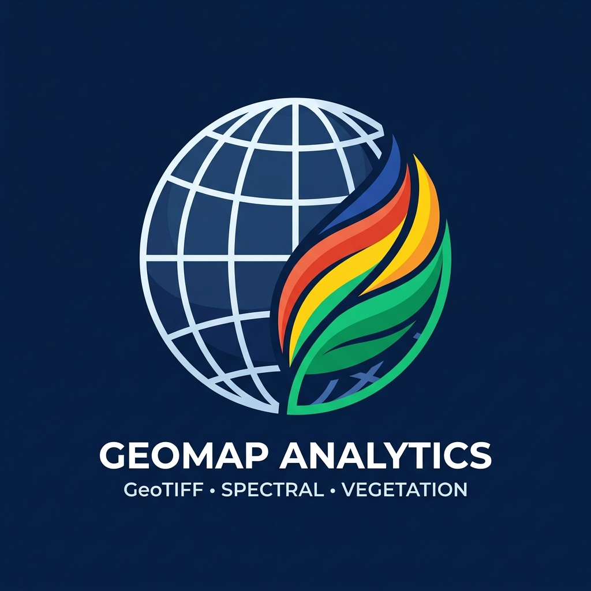

<a id="readme-top"></a>

<!-- ESCUDOS DO PROJETO -->

[![Contributors][contributors-shield]][contributors-url]
[![Forks][forks-shield]][forks-url]
[![Stargazers][stars-shield]][stars-url]
[![Issues][issues-shield]][issues-url]
[![MIT License][license-shield]][license-url]
[![LinkedIn][linkedin-shield]][linkedin-url]

<!-- LOGOTIPO DO PROJETO -->
<br />
<div align="center">
  <a href="https://github.com/alissonpef/geotiff_project">
    
  </a>

  <h3 align="center">GeoTIFF Tile Server</h3>

  <p align="center">
    Servidor REST performático em TypeScript/Express para servir tiles XYZ de arquivos GeoTIFF multiespectrais com cálculo dinâmico de índices espectrais e colormaps científicos.
    <br />
    <a href="https://github.com/alissonpef/geotiff_project"><strong>Explore a documentação »</strong></a>
    <br />
    <br />
    <a href="https://github.com/alissonpef/geotiff_project/issues/new?labels=bug&template=bug-report.md">Reportar Bug</a>
    &middot;
    <a href="https://github.com/alissonpef/geotiff_project/issues/new?labels=enhancement&template=feature-request.md">Solicitar Recurso</a>
  </p>
</div>

<!-- ÍNDICE -->
<details>
  <summary>Índice</summary>
  <ol>
    <li>
      <a href="#sobre-o-projeto">Sobre O Projeto</a>
      <ul>
        <li><a href="#construído-com">Construído Com</a></li>
      </ul>
    </li>
    <li>
      <a href="#começando">Começando</a>
      <ul>
        <li><a href="#pré-requisitos">Pré-requisitos</a></li>
        <li><a href="#instalação">Instalação</a></li>
      </ul>
    </li>
    <li><a href="#uso">Uso</a></li>
    <li><a href="#contribuindo">Contribuindo</a></li>
    <li><a href="#licença">Licença</a></li>
    <li><a href="#contato">Contato</a></li>
  </ol>
</details>

<!-- SOBRE O PROJETO -->

## Sobre O Projeto

O **GeoTIFF Tile Server** é uma API REST de alta performance desenvolvida para carregar, processar e servir imagens aéreas e de satélite no formato GeoTIFF multibanda em mapas web (Leaflet, OpenLayers, Mapbox).

O projeto resolve a complexidade de manipular grandes arquivos GeoTIFF e calcular índices espectrais sob demanda. Ao invés de pré-renderizar gigabytes de dados estáticos, o servidor gera os tiles de forma dinâmica na CPU e aplica tabelas de cores científicas em milissegundos.

<p align="right">(<a href="#readme-top">voltar ao topo</a>)</p>

### Construído Com

Esta seção lista os principais frameworks e bibliotecas utilizados no desenvolvimento deste projeto:

- [![Node.js][Node.js-shield]][Node-url]
- [![TypeScript][TypeScript-shield]][TypeScript-url]
- [![Express][Express-shield]][Express-url]
- [![Sharp][Sharp-shield]][Sharp-url]
- [![Chroma-js][Chroma-shield]][Chroma-url]
- [![GeoTIFF][GeoTIFF-shield]][GeoTIFF-url]

<p align="right">(<a href="#readme-top">voltar ao topo</a>)</p>

<!-- COMEÇANDO -->

## Começando

Para configurar uma cópia local do servidor em execução, siga os passos abaixo.

### Pré-requisitos

Certifique-se de ter o Node.js instalado (versão >= 20.0.0).

- npm
  ```sh
  npm install npm@latest -g
  ```

### Instalação

1. Clone o repositório:
   ```sh
   git clone https://github.com/alissonpef/geotiff_project.git
   ```
2. Instale os pacotes NPM:
   ```sh
   npm install
   ```
3. Configure o arquivo `.env` baseado no `.env.example`:
   ```properties
   PORT=3001
   DATA_DIR=./data
   DEFAULT_GEOTIFF=odm_orthophoto_multi.tif
   ```
4. Altere a URL do remote git para evitar pushs acidentais para o projeto base:
   ```sh
   git remote set-url origin alissonpef/geotiff_project
   git remote -v
   ```

<p align="right">(<a href="#readme-top">voltar ao topo</a>)</p>

<!-- EXEMPLOS DE USO -->

## Uso

Use esta seção para entender como fazer requisições à API.

### Endpoints e Parâmetros

#### 1. Tiles XYZ RGB Simples

Retorna um tile renderizado com as três primeiras bandas visíveis (Red, Green, Blue) da imagem.

```http
GET /tile/:tiffId/:z/:x/:y?size=256
```

**Exemplo:**

```bash
curl "http://localhost:3001/tile/odm_orthophoto/20/381004/585533?size=512" -o tile.png
```

#### 2. Tiles XYZ de Índices Espectrais

Calcula dinamicamente o índice espectral solicitado aplicando uma paleta de cores.

```http
GET /index/:tiffId/:z/:x/:y?indexName=NDVI&colormap=RdYlGn
```

- `indexName`: NDVI, NDWI, EVI, SAVI, VARI, NDMI, NBR, GNDVI, NDRE ou MSAVI.
- `equation`: Equação customizada (ex: `(nir-red)/(nir+red)`).
- `colormap`: `viridis`, `RdYlGn`, `RdYlBu`, `Spectral` ou `Greys`.

**Exemplo:**

```bash
curl "http://localhost:3001/index/odm_orthophoto_multi.tif/21/381005/585528?indexName=NDVI&colormap=RdYlGn" -o ndvi.png
```

#### 3. Listagem de Índices

Lista todos os índices espectrais nativos suportados e suas equações correspondentes.

```http
GET /index/list
```

#### 4. VARI (Visual Atmospherically Resistant Index)

Calcula o índice VARI diretamente para imagens RGB padrão.

```http
GET /vari/:tiffId/:z/:x/:y
```

#### 5. Integração com Leaflet

```javascript
const ndviLayer = L.tileLayer(
  'http://localhost:3001/index/odm_orthophoto_multi.tif/{z}/{x}/{y}?indexName=NDVI&colormap=RdYlGn',
  { maxZoom: 22 },
);
ndviLayer.addTo(map);
```

<p align="right">(<a href="#readme-top">voltar ao topo</a>)</p>

<!-- CONTRIBUINDO -->

## Contribuindo

As contribuições são o que tornam a comunidade open source um lugar tão incrível para aprender, inspirar e criar. Qualquer contribuição que você fizer será **muito apreciada**.

Se você tiver alguma sugestão que tornaria isso melhor, por favor faça o fork do repositório e crie um pull request. Você também pode simplesmente abrir uma issue com a tag "enhancement".
Não se esqueça de dar uma estrela ao projeto! Obrigado novamente!

1. Faça o Fork do Projeto
2. Crie a sua Branch de Funcionalidade (`git checkout -b feature/FuncionalidadeIncrivel`)
3. Commit suas Mudanças (`git commit -m 'Adicione alguma FuncionalidadeIncrivel'`)
4. Faça o Push para a Branch (`git push origin feature/FuncionalidadeIncrivel`)
5. Abra um Pull Request

### Principais contribuidores:

<a href="https://github.com/alissonpef/geotiff_project/graphs/contributors">
  
</a>

<p align="right">(<a href="#readme-top">voltar ao topo</a>)</p>

<!-- LICENÇA -->

## Licença

Distribuído sob a Licença MIT. Veja `LICENSE` para mais informações.

<p align="right">(<a href="#readme-top">voltar ao topo</a>)</p>

<!-- CONTATO -->

## Contato

Alisson Pereira Ferreira - alissonpef@gmail.com - [LinkedIn](https://www.linkedin.com/in/alisson-pereira-ferreira/)

Link do Projeto: [https://github.com/alissonpef/geotiff_project](https://github.com/alissonpef/geotiff_project)

<p align="right">(<a href="#readme-top">voltar ao topo</a>)</p>

---

Made with ❤️ by **Alisson Pereira**.

<!-- MARKDOWN LINKS & IMAGES -->

[contributors-shield]: https://img.shields.io/github/contributors/alissonpef/geotiff_project.svg?style=for-the-badge
[contributors-url]: https://github.com/alissonpef/geotiff_project/graphs/contributors
[forks-shield]: https://img.shields.io/github/forks/alissonpef/geotiff_project.svg?style=for-the-badge
[forks-url]: https://github.com/alissonpef/geotiff_project/network/members
[stars-shield]: https://img.shields.io/github/stars/alissonpef/geotiff_project.svg?style=for-the-badge
[stars-url]: https://github.com/alissonpef/geotiff_project/stargazers
[issues-shield]: https://img.shields.io/github/issues/alissonpef/geotiff_project.svg?style=for-the-badge
[issues-url]: https://github.com/alissonpef/geotiff_project/issues
[license-shield]: https://img.shields.io/github/license/alissonpef/geotiff_project.svg?style=for-the-badge
[license-url]: https://github.com/alissonpef/geotiff_project/blob/main/LICENSE
[linkedin-shield]: https://img.shields.io/badge/-LinkedIn-black.svg?style=for-the-badge&logo=linkedin&colorB=555
[linkedin-url]: https://www.linkedin.com/in/alisson-pereira-ferreira/
[Node.js-shield]: https://img.shields.io/badge/Node.js-339933?style=for-the-badge&logo=nodedotjs&logoColor=white
[Node-url]: https://nodejs.org/
[TypeScript-shield]: https://img.shields.io/badge/TypeScript-3178C6?style=for-the-badge&logo=typescript&logoColor=white
[TypeScript-url]: https://www.typescriptlang.org/
[Express-shield]: https://img.shields.io/badge/Express-000000?style=for-the-badge&logo=express&logoColor=white
[Express-url]: https://expressjs.com/
[Sharp-shield]: https://img.shields.io/badge/Sharp-990000?style=for-the-badge&logo=sharp&logoColor=white
[Sharp-url]: https://sharp.pixelplumbing.com/
[Chroma-shield]: https://img.shields.io/badge/Chroma.js-FF6F00?style=for-the-badge&logo=chroma&logoColor=white
[Chroma-url]: https://gka.github.io/chroma.js/
[GeoTIFF-shield]: https://img.shields.io/badge/GeoTIFF.js-228B22?style=for-the-badge&logo=geotiff&logoColor=white
[GeoTIFF-url]: https://geotiffjs.github.io/
